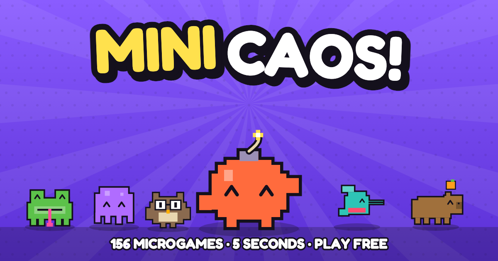

<div align="center">



# Claude Ware

**100+ five-second microgames. 14 stages. Bosses. Zero installs.**
A WarioWare-style game that runs in your browser, on desktop and phone.

### [▶ Play now: claudeware.guille.tech](https://claudeware.guille.tech)

[](https://claudeware.guille.tech)
[](#whats-inside)
[](#add-your-own-minigame)

</div>

---

## What is it?

You get a few seconds per game and a one-word command: **SWAT!**, **JUMP!**, **TYPE!**. Figure out what to do and do it before the bomb goes off. Clear a stage, beat the boss, climb the leaderboard, then send your score to a friend and dare them to beat it.

- **No download, no signup.** Open the link and play. Sign in with Google only if you want to save progress and appear on leaderboards.
- **Phone and desktop.** Mouse, keyboard and touch controls for every game.
- **Challenge links.** Share a score and your friend sees "NAME CHALLENGES YOU" and drops straight into the same stage.
- **Practice mode.** Pick any microgame and replay it at any speed.
- **English and Spanish**, with a simple path to add more languages.
- **Tiny stack.** Vanilla JavaScript and `<canvas>`. No build step, no framework.

## What's inside

14 themed stages, each with its own host, microgame pool, speed curve and boss.

| Stage | Vibe |
|---|---|
| Bug Hunt | Click it. Squash it. |
| Keyboard Kingdom | Fingers on the keys! |
| Reflex Rush | Faster. Then faster. |
| Mouse Mayhem | Point, drag, scrub! |
| Brain Break | Think fast! |
| Mega Mix | Everything. At once. |
| Wii Waggle | Smooth moves, Claude! |
| Cube Party | Mega party game, mega fast! |
| Touch Screen | Poke it. Draw it. Cut it. |
| Get Together | Stay still. Pick. Run. Fry. |
| 3D Dimension | Now with depth! |
| Mega Microgame$ | Old-school. Four colours. Go! |
| Twisted! | Tilt it. Spin it. Steer it! |
| Move It! | Strike a pose. Hit the beat! |

### Play with friends (PARTY)

Create a room, share the 4-letter code (or the `/r/CODE` link) and play live. Eight modes: **VERSUS** (same microgame, best takes the points), **TEAM** (shared lives) and **DUO**: two players inside *one* microgame with different roles (catch & throw, decode, lever & crank, steer & boost) who win or lose together. **SURVIVAL** gives each player three lives; **KNOCKOUT** eliminates on the first failure. **LANTERNS** rotates one active player while the others reveal the dark playfield with mouse, touch or arrow-controlled lights (three shared lives). **CARDS** draws from a 24-card deck: accumulate microgames, complete the entire pile on a PLAY card to collect it and the pot, or forfeit your cards on failure; assistants can steal one rival card per microgame. **BALLOON** lets assistants tap/press Space to inflate a shared balloon: win to pass the turn, fail to keep playing, and lose when it pops during your turn. LANTERNS, CARDS and BALLOON use all 156 registered single-player microgames, including the 3D games; DUO role games and stage bosses keep their own formats. A shuffled catalog avoids repeats until every game has been used; the 16 microgame cards in each deck are distinct. All eight are selectable directly in the room lobby. DUO needs the PocketBase backend (inputs are relayed live through `POST /api/party/sig`); tests: `node pocketbase/pb_hooks/party.test.js`, `node test/duo.test.js` (bots play both roles headlessly) and `PB=http://127.0.0.1:8090 node test/party.e2e.js` against a running server. Turn-mode checks: `node test/party-modes.test.js`, `node test/party-modes-client.test.js`, and `PB=http://127.0.0.1:8090 node test/party-modes.e2e.js`. Deploy the frontend and PocketBase hooks/migrations together; the new modes require the `extra` room field added by `1791030000_party_modes.js` and the private catalog storage expansion in `1791030500_party_catalog.js`. Catalog checks: `node scripts/party-catalog.js --check` and `node test/party-catalog.test.js`.

**Shared screens and spectators.** LANTERNS, CARDS and BALLOON show the active player’s actual microgame alongside the companions’ controls. Players who finish early in VERSUS/TEAM, or are eliminated in SURVIVAL/KNOCKOUT, can watch and select a remaining player. Spectators receive visual snapshots without simulating games or submitting results. Checks: `node test/party-spectators.test.js` and `PB=http://127.0.0.1:8090 node test/party-spectators.e2e.js`. Restart PocketBase when deploying the updated relay hooks.

**Voice chat.** Optional and off by default: the VOICE button in any room screen asks for the microphone, then connects the players with WebRTC audio (peer to peer; the server only relays the setup messages via `POST /api/party/vsig`). Tap cycles MIC ON → MUTED → OFF, and each player card has a HEAR/MUTED switch. Only STUN servers are configured, so a few strict networks may not connect (a TURN server would fix that).

**Friends list.** Signed-in players can follow each other (profile → FOLLOW, or ADD by player name in *MY FRIENDS*). Following someone who follows you back makes you friends; the list has FRIENDS / FOLLOWING / FOLLOWERS tabs. Follows live in the `friends` collection (migration `1790901000_friends.js`, visible only to the two people involved, max 200 follows); test: `PB=http://127.0.0.1:8099 ADMIN=email:password node test/friends.e2e.js` (needs a local superuser, see the file header).

## 💡 Want a minigame that isn't here yet?

**This game grows with its players.** Every microgame is one small JavaScript function, so adding yours is a very approachable first contribution, even if you have never contributed to open source before.

Two ways to help:

1. **Suggest one.** [Open a "New minigame" issue](../../issues/new?template=minigame-idea.yml) with a command word (like `SWAT!`) and one sentence on how it plays. Good ideas get built, and you get credit.
2. **Build one.** Follow the guide below and send a pull request.

## Add your own minigame

A microgame is a function that takes a speed multiplier and returns an object describing the game. Here is the whole shape (see `js/games/wave1.js` for real examples):

```js
function gHello(sp) {                     // sp = speed multiplier, grows as the stage goes on
  const g = {
    cmd: 'HELLO!',                        // the big command shown at the start
    hint: 'CLICK THE BUTTON',             // controls hint (desktop)
    thint: 'TAP THE BUTTON',              // optional: controls hint on touch devices
    dur: 5,                               // seconds before time runs out
    update(dt) { /* move things */ },
    down(p) {                             // pointer pressed: p.x, p.y in 800x600 canvas space
      g.result = 'win';                   // set 'win' or 'lose' to finish the game
    },
    draw(t) {                             // t = progress through the game
      bg('#B8E05A', '#a8d046', t);        // helpers for drawing live in js/core.js
    }
  };
  return g;
}
reg('hello', gHello, 'HELLO');            // register it: id, function, display name
```

Games can also use `key`, `up` and `move` handlers. Win by setting `g.result = 'win'`; if time runs out without a result, the player loses (set `timeWin: true` for "survive until the clock ends" games).

### Steps

1. **Fork** the repo and clone it.
2. **Write your game** in a new file in `js/games/` (or add it to a themed file like `js/games/wave4.js`) and register it with `reg(...)`.
3. **Add the script tag** to `index.html` after the other `js/games/*.js` tags (new files only).
4. **Put it in a stage pool.** Add its id to a stage's `pool` array in `js/stages.js`. Every game is also available in Practice mode.
5. **Add Spanish** (optional but appreciated) in `js/i18n/es/`. The English text is the key: `'HELLO!': '¡HOLA!'`. Run `node test/i18n.test.js` to check coverage.
6. **Test it.** Serve the folder and play it:
   ```sh
   python3 -m http.server 8000      # then open http://localhost:8000
   ```
   Open **Practice** from the title screen and pick your game. Try it on a phone-sized window too.
7. **Open a PR** with a short description, and a screen recording or GIF if you can.

### What makes a good microgame

- **Understandable in under a second.** One verb, one command word.
- **Over in about 5 seconds.** Win or lose fast.
- **Scales with `sp`.** Faster or harder at higher speed, but never unfair.
- **Works on mouse, keyboard *and* touch** (or at least mouse and touch).
- **Looks like the rest.** Thick outlines, flat bright colours, the helpers in `js/core.js`.
- **Original.** No copyrighted characters, music or assets.

Not sure where to start? Read one small game in `js/games/wave1.js`, change a number, refresh, and see what happens.

## Other ways to contribute

- 🐛 **Report a bug** with the browser, device and microgame name.
- 🌍 **Translate** it: add a language in `js/i18n.js` and copy `js/i18n/es/`.
- 🎨 **Polish** art, animation and sound effects of existing games.
- ⭐ **Star the repo** and share your best score. It helps more people find the game.

## Run it locally

The game is static files, so any web server works:

```sh
git clone https://github.com/guillermoscript/minigames.git
cd minigames
python3 -m http.server 8000
```

Open <http://localhost:8000>. Guest play works from there. Accounts, leaderboards and cloud saves need the PocketBase backend, which is documented in [docs/SELF-HOSTING.md](docs/SELF-HOSTING.md) along with deployment, Google sign-in and the database rules.

## Install the app (PWA)

On supported browsers, use **INSTALL APP** on the title screen or stage menu. On iPhone/iPad, open the site in Safari and choose **Share → Add to Home Screen**. The installed game opens in its own window. Installation requires HTTPS (or localhost for development).

After the first visit finishes downloading the offline files, guest stages and practice work without internet, including the 3D games. Accounts, cloud saves, leaderboards, party rooms and voice chat require a connection. Files are refreshed from the network when online; browser storage cleanup can remove the offline copy.

Deploy `manifest.webmanifest`, `sw.js` and `img/icons/` alongside the game. Docker and `pocketbase/dev.sh` include them automatically. To verify locally, serve the folder, open it once, wait for the service worker to activate, switch DevTools to offline, and reload `/` and `/?lang=es`.

## Project layout

```
index.html, css/, js/      the game
js/games/                  all the microgames (one file per theme)
js/stages.js               stages, pools, speed curves, bosses
js/i18n/                   translations
pocketbase/                optional backend: accounts and leaderboards
docs/SELF-HOSTING.md       backend, deploy and ops docs
test/                      node tests
```

---

<div align="center">

Made by [@guillermoscript](https://github.com/guillermoscript) and contributors. If you had fun, **star the repo** ⭐ and tell a friend.

</div>
